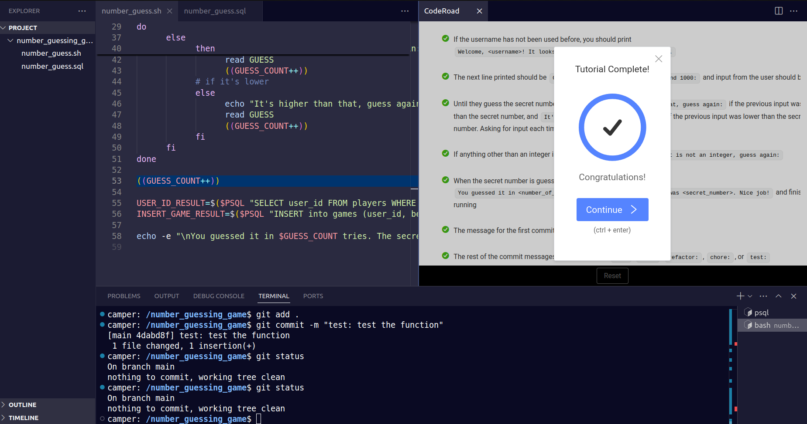

# Number Guessing Game

This is a **Bash-based** number guessing game that tracks user statistics, including the number of games played and the best performance. The project was created to practice Bash scripting and file handling with Git. It is also a part of the FreeCodeCamp Relational Database Certification.

## Project Files
- **number_guess.sh** – A Bash script that generates a secret number for the user to guess, tracks the number of guesses, and stores user statistics in a database.
- **number_guess.sql** - Contains the PostgreSQL database schema and initial data setup.

## Setup Instructions

1. Clone this repository:
   ```
   git clone git@github.com:jay-tun/number-guessing-game.git
   cd number-guessing-game
   ```
2. Import the database schema:
   ```
   psql -U freecodecamp -d number_guess -f number_guess.sql
   ```
3. Make the script executable:
   ```
   chmod +x number_guess.sh
   ```
4. Run the script:
   ```
   ./number_guess.sh
   ```


## Result


